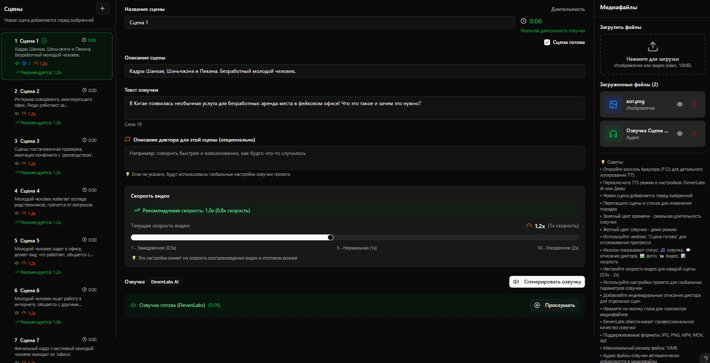

# Clip Crafter (Scenario Editor)

Веб‑приложение для подготовки видеороликов из текстовых сценариев: разбивка сценария на сцены, добавление медиа, генерация озвучки (TTS), экспорт и хранение проектов в Supabase.

### Скриншот



### Возможности
- Разбиение сценария на сцены через Gemini (Google Generative Language API)
- Редактор проекта с:
  - списком сцен (перетаскивание, удаление, статус «готово»)
  - редактором текста озвучки и описаний
  - настройкой скорости видео per‑scene
  - панелью медиа (загрузка/удаление/предпросмотр)
- Озвучка (TTS):
  - ElevenLabs AI (при наличии API‑ключа)
  - Демо‑режим с автоматическим/принудительным фолбэком
  - Поддержка пользовательских голосов ElevenLabs (ID из Voice Library)
- Глобальные настройки приложения (тёмная/светлая тема, библиотека голосов)
- Сохранение/загрузка/удаление проектов (KV), экспорт проекта, хранение файлов в Supabase Storage
- Быстрый запуск локально (Vite, порт 9780)

---

## Архитектура
- Frontend: React + Vite + Tailwind (шайди‑компоненты на Radix UI)
- Edge Function (Supabase): Hono, KV‑хранилище, Supabase Storage
- Интеграции:
  - Gemini (`GEMINI_API_KEY`) — парсинг сценария в сцены
  - ElevenLabs (`ELEVENLABS_API_KEY`) — TTS (с фолбэком на демо)

Статусные пути Edge‑функции (base) — `/functions/v1/make-server-766e6542`.

---

## Быстрый старт (Frontend)

Предпосылки:
- Node.js >= 18
- npm

Шаги:
1. Установите зависимости
```bash
npm install
```
2. Создайте `.env` в корне проекта и заполните переменные окружения:
```bash
# URL проекта Supabase, например: https://<project-id>.supabase.co
VITE_SUPABASE_URL="https://<project-id>.supabase.co"
# Публичный анонимный ключ Supabase (anon key)
VITE_SUPABASE_ANON_KEY="<anon-key>"
# (необязательно) явный project id для клиента
VITE_SUPABASE_PROJECT_ID="<project-id>"
```
3. Запустите dev‑сервер (Vite, порт 9780)
```bash
npm run dev
```
4. Откройте `http://localhost:9780`

Примечания:
- Если `VITE_SUPABASE_URL` и/или `VITE_SUPABASE_ANON_KEY` не заданы, клиент попытается использовать запасной `projectId` и выведет предупреждение в консоли.

---

## Edge Function (Supabase)

Код функции: `supabase/functions/server/index.tsx`

Требуемые секреты (в Supabase → Project Settings → Config → Secrets):
- `SUPABASE_URL` — URL проекта
- `SUPABASE_SERVICE_ROLE_KEY` — service role key (для KV/Storage)
- `GEMINI_API_KEY` — ключ Gemini для парсинга сценариев
- `ELEVENLABS_API_KEY` — ключ ElevenLabs для TTS (опционально, иначе будет демо‑фолбэк)

Хранилище файлов: приватный бакет `make-766e6542-media` (создаётся автоматически при старте функции). Ссылки на файлы выдаются через подписанные URL.

### Эндпоинты
База: `https://<project-id>.supabase.co/functions/v1/make-server-766e6542`
- `GET /health` — проверка доступности
- `POST /parse-scenario` — парсинг сценария в сцены через Gemini
  - body: `{ text: string }`
- `POST /save-project` — сохранить проект в KV
  - body: `{ projectId, title, scenes, settings }`
- `GET /load-project/:projectId` — загрузить проект
- `GET /export-project/:projectId` — экспорт проекта (возвращает метаданные и ссылку)
- `DELETE /delete-project/:projectId` — удалить проект
- `POST /upload-media` — загрузка медиафайла (FormData: `file`, `sceneId`)
- `POST /generate-tts` — генерация озвучки
  - body: `{ text, sceneId, voiceSettings, sceneNarratorDescription, ttsSettings }`

Лимиты:
- Загрузка медиа: до 10 МБ на файл (см. `MAX_FILE_SIZE`)

---

## Режимы TTS
- ElevenLabs AI: высокое качество. Требует `ELEVENLABS_API_KEY` и баланс.
- Демо‑режим: автогенерация WAV с тонами/тишиной (без внешних API). Включается:
  - автоматически при ошибках ElevenLabs (квота/ключ и т. п.)
  - принудительно в настройках проекта (переключатель «Принудительный демо режим»)

Пользовательские голоса ElevenLabs:
- Откройте «Настройки» → «Глобальные настройки» и добавьте голос из Voice Library (вставьте ссылку, ID извлечётся автоматически).
- В настройках проекта можно выбрать пользовательский голос (перекрывает встроенный).

---

## Python: нарезка видео и импорт проекта
Скрипт: `video_to_project.py`

Предпосылки:
- Python ≥ 3.10
- Установите `uv` (менеджер пакетов Python): https://docs.astral.sh/uv/
- Системные утилиты: `ffmpeg`, `ffprobe`

Установка окружения:
```bash
uv sync            # базовые зависимости
uv sync --extra db # при необходимости интеграции с БД
```

Пример запуска (см. `.vscode/launch.json`):
```bash
python video_to_project.py \
  --project-title "Мой проект" \
  --project-dir ./my_project \
  --min-segment 5 \
  --scene-threshold 0.03 \
  ./example_video.mp4 \
  --push-to-db
```
Ключи:
- `--min-segment` — минимальная длительность сегмента (сек)
- `--scene-threshold` — порог детекции сцены для ffprobe (0..1)
- `--push-to-db` — после создания сохранить проект в Supabase (через Edge Function)

Переменные окружения для push (читаются из env / `.env`):
- `VITE_SUPABASE_URL` или `SUPABASE_URL`
- `VITE_SUPABASE_ANON_KEY` или `SUPABASE_SERVICE_ROLE_KEY`/`SUPABASE_ANON_KEY`

Экспорт в файл: по умолчанию `project.json` внутри `--project-dir`.

---

## Сценарий работы в UI
1. На вкладке «Новый проект» вставьте сценарий и нажмите «Создать проект» — сцены будут сгенерированы через Gemini.
2. Редактируйте сцены: заголовок, описание, текст озвучки, скорость видео, медиа.
3. В «Настройках» выберите режим TTS и голос. Нажмите «Сгенерировать озвучку» — аудио попадёт в медиа сцены.
4. Сохраняйте проект, загружайте существующие, экспортируйте.

---

## Разработка
Скрипты npm:
```json
"dev": "vite",
"build": "tsc && vite build",
"preview": "vite preview",
"lint": "eslint . --ext ts,tsx"
```
Порт разработки: `9780` (см. `vite.config.ts`).

VS Code:
- Задачи в `.vscode/tasks.json` (npm/uv)
- Конфигурации в `.vscode/launch.json` (запуск браузера и Python‑скрипта)

---

## Лицензия
MIT
